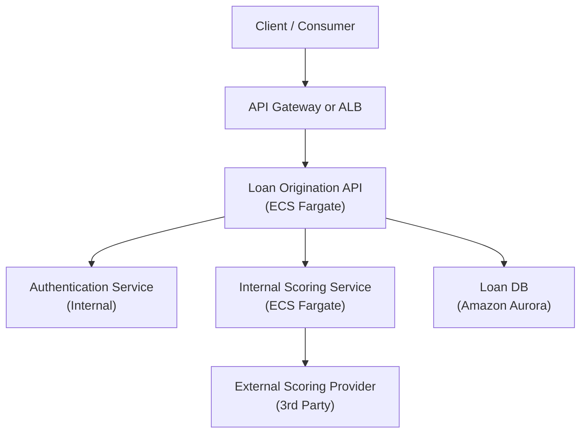
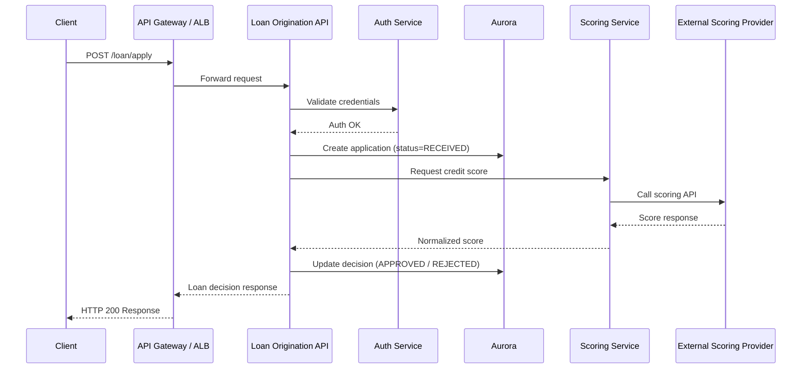

# Demo workflow
Build and push services images:
```bash
    docker login
    sh ./scripts/build-and-push.sh
```
Deploy stack:
```
    terraform -chdir=./infra/environments/dev init
    terraform -chdir=./infra/environments/dev plan
    terraform -chdir=./infra/environments/dev apply
```
## Repo organization
1. services/ and submodule infra/modules/demo/ --> prerrequisites infra: 
   - Vpc, ecs w/ fargate, alb, apigw, aurora
   - ECR or DockerHub image: Originación crédito
   - ECR or DockerHub image: Servicio interno autenticación
   - ECR or DockerHub image: Proveedor externo scoring
2. Submodule infra/modules/o11y/ --> Observability stack
   - Logs en Amazon CloudWatch Logs.
   - Métricas en Amazon CloudWatch.
   - Opcional: AWS X-Ray y/o APM externo.
3. infra/environments/* --> Root module per environment
4. Scripts
   - Build and push docker images

# Problem statement
It is assumed Loan API is publicly exposed. 

## Demo app overview
**General flow**
Basically, API request will accept loan applications, authenticate the user, get score via external dependency, persist application & resolution, and respond to client that initiated the request.
Steps listing:
1. Loan API POST /loan/apply
{
  "userId": "123",
  "amount": 15000,
  "termMonths": 36,
  "income": 4000
}
2. Authentication: synchronous, strict timeout (200 ms max), no retries
3. Record initial application on database STATUS = RECEIVED
4. Scoring Service: synchronous, external dependency and retries logic imply larger timeout (1-2 secs)
{
  "applicationId": "app-abc",
  "userId": "123",
  "amount": 15000,
  "income": 4000
}
** From hints on challenge instructions (retry adjustments and rollback), I assume an internal scoring service that encapsulates external provider.
5. Scoring Service to External provider: random latency and random failures for demo purposes
   - Retries, breaker & timeouts
{
  "score": 720,
  "riskBand": "LOW",
  "provider": "ExternalScoreCo"
}
6. Loan API computes & records decision STATUS = APPROVED | REJECTED, interest rate = X
7. Loan API response to client
{
  "applicationId": "app-abc",
  "status": "APPROVED",
  "interestRate": 11.9
}

**Microservices interaction diagram**


**Request flow diagram**


**Database example setup**
Database: loans_db
Table creation: CREATE TABLE loan_applications (
    application_id VARCHAR(50) PRIMARY KEY,
    user_id         VARCHAR(50),
    amount          NUMERIC,
    term_months     INT,
    income          NUMERIC,
    status          VARCHAR(20),
    created_at      TIMESTAMP DEFAULT now()
);
Possible Status:
- RECEIVED
- APPROVED
- REJECTED

## Demo infra overview
**Networking**
vpc_cidr = "10.0.0.0/16"
public_subnets = 10.0.0.0/24, 10.0.1.0/24
private_subnets = 10.0.10.0/24, 10.0.11.0/24
private_db_subnets = 10.0.20.0/24, 10.0.21.0/24


# Observability overview
O11y conceptual levels:
   - Individual components level
   - System level --> Most important metrics, seen by users, e.g. SLO 99.9% of loan-api requests take <800ms
   - Application-level vs Infrastructure-level measurements, e.g. app bugs vs capacity issues
O11y conceptual questions:
- Is the system working??
- It it fails, where does it fail? Why did it fail?
- How is failure experienced by user?
O11y conceptual frameworks:
- O11y pillars --> metrics, logs, traces
- Golden signals
  - Latency: p95, both Compute and DB
  - Traffic
  - Errors: 
  - Saturation

## O11y pillars on given AWS services
Per component:
**ECS**
[Metrics at cluster & service levels](https://docs.aws.amazon.com/AmazonECS/latest/developerguide/cloudwatch-metrics.html), for free:
- CPUUtilization
- MemoryUtilization
Metris at task level, enabling [Amazon ECS CloudWatch Container Insights](https://docs.aws.amazon.com/AmazonCloudWatch/latest/monitoring/Container-Insights-metrics-ECS.html) with additional cost:
- RunningTaskCount
- PendingTaskCount
- DesiredTaskCount
- CpuUtilized
- MemoryUtilized
Logs: awslogs log driver in task definition
**API Gateway**
NLB: https://docs.aws.amazon.com/elasticloadbalancing/latest/network/load-balancer-cloudwatch-metrics.html (Not used)
Metrics on [APIGW](https://docs.aws.amazon.com/apigateway/latest/developerguide/monitoring-cloudwatch.html): 
- Latency / IntegrationLatency
- 5XXError
- Count
Logs per stage:
- Access logs (structured)
- Execution logs (verbose)
**ALB**
Metrics on [ALB](https://docs.aws.amazon.com/elasticloadbalancing/latest/application/load-balancer-cloudwatch-metrics.html): 
- RequestCount
- TargetResponseTime
- HTTPCode_ELB_5XX_Count
- HTTPCode_Target_2XX_Count
- HTTPCode_Target_5XX_Count
- HealthyHostCount / UnHealthyHostCount
Logs: We may enable ALB access logs, Connection logs, Healthcheck logs, delivered to S3
**Aurora**
Metrics: https://docs.aws.amazon.com/AmazonRDS/latest/AuroraUserGuide/Aurora.AuroraMonitoring.Metrics.html
- CPUUtilization
- DatabaseConnections
- FreeableMemory
- ReadIOPS / WriteIOPS
- ReadLatency / WriteLatency
- DiskQueueDepth
Logs: PostgreSQL logs (error, slow query)
**VPC**
Metrics by default:
- NAT Gateway: BytesIn / BytesOut
- ENI-level metrics (limited)
Logs: enable VPC Flow Log


# References
Golden signals: https://logz.io/blog/evops-sre-metrics/

High-level overview of loan process
- https://www.wallarm.com/what/why-your-lending-business-needs-apis-a-complete-guide-to-lending-api-integration
- https://farmcreditcfl.com/es/recursos/blog/los-cinco-pasos-basicos-del-proceso-de-aprobacion-del-prestamo
- https://www.kavak.com/mx/blog/proceso-de-aprobacion-de-credito-mejora-tu-perfil
- https://konfio.mx/blog/soluciones-financieras/creditos/pedir-credito-en-konfio/?srsltid=AfmBOoogbqh858QBYqiSygnW0wPZ0_t_LNhWeFs5qSvOtpVMc091O7hN
- https://konfio.mx/blog/soluciones-financieras/creditos/el-proceso-esta-en-tus-manos/?srsltid=AfmBOoqHv9KKo2fO0XR2ii9u2DOSC04_ifdtPyorjc-K4ttoUfZcaxOv


# BRAINSTORMING
AWS Secrets or environment variables for Terraform e.g. Aurora db setup
4XX errors optionally tracked
NAT gateway per AZ on production environments
Extra reliability by deploying on multiple regions
Monitoring auth and scoring services as well
Loan API requires HA (High Availability): redundancy via replication and multiple AZs.
Estrategia de seguridad y control de costos: CloudTrail? auditing over networking e.g. sgs across stack

O11y pillars for Request flow?
Access logs, http status code, request size anomalies
We may use derived metrics, logs and traces with correlation via payload fields (e.g. trace_id, request_id, applicationId).
External dependency metrics: synthetic metrics?? Timeout rate, Retry count, Circuit breaker open/closed from custom CloudWatch metrics via app logs.
